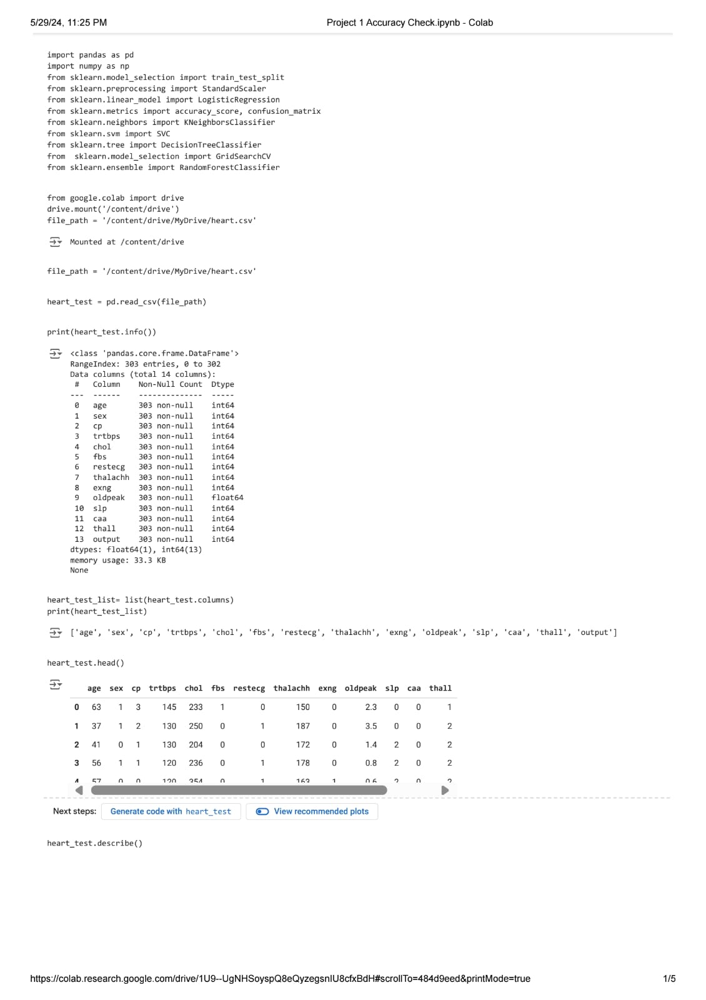
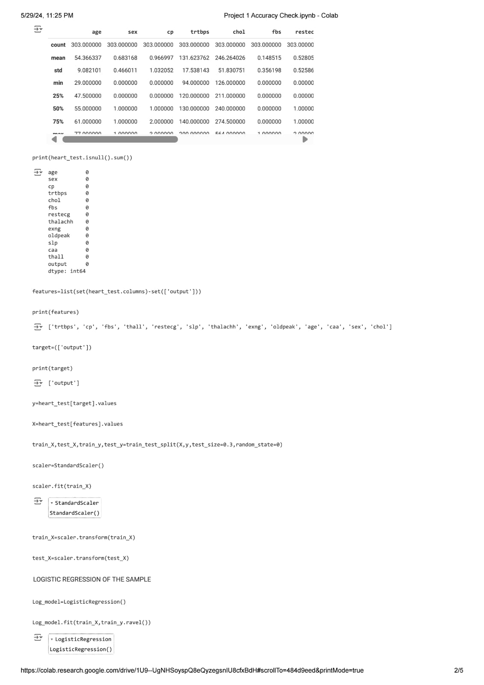
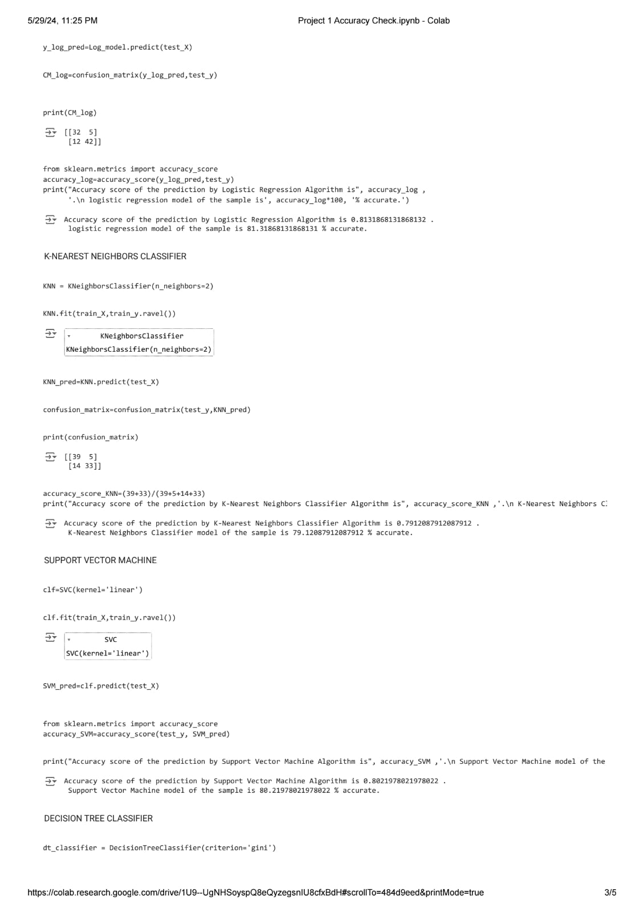
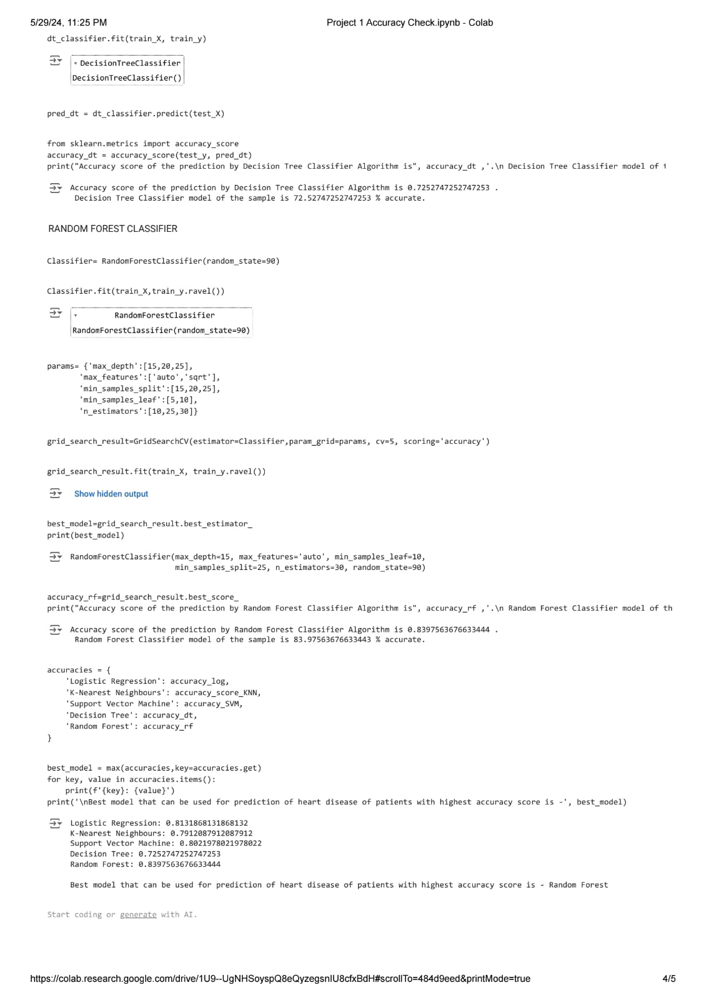

# MLHeartDiseasePredictor

## Introduction
Heart disease is one of the leading causes of death worldwide. Early prediction of heart disease can significantly improve patient outcomes. This project utilizes machine learning techniques to predict heart disease based on clinical parameters such as age, sex, chest pain type, resting blood pressure, and others.

## Dataset
The dataset used in this project contains 13 clinical parameters and a target variable:
1. **age**: Age in years
2. **sex**: (1 = male; 0 = female)
3. **cp**: Chest pain type (0: Typical angina, 1: Atypical angina, 2: Non-anginal pain, 3: Asymptomatic)
4. **trtbps**: Resting blood pressure (in mm Hg)
5. **chol**: Serum cholesterol in mg/dl
6. **fbs**: Fasting blood sugar (> 120 mg/dl) (1 = true; 0 = false)
7. **restecg**: Resting electrocardiographic results (0: Nothing to note, 1: ST-T Wave abnormality, 2: Possible or definite left ventricular hypertrophy)
8. **thalachh**: Maximum heart rate achieved
9. **exng**: Exercise induced angina (1 = yes; 0 = no)
10. **oldpeak**: ST depression induced by exercise relative to rest
11. **slp**: The slope of the peak exercise ST segment (0: Upsloping, 1: Flatsloping, 2: Downsloping)
12. **caa**: Number of major vessels (0-3) colored by fluoroscopy
13. **thall**: Thalium stress result (1, 3: normal, 6: fixed defect, 7: reversible defect)
14. **output**: Target variable (1 = has heart disease, 0 = no heart disease)

## Models and Evaluation
The following machine learning models were trained and evaluated:
1.Logistic Regression
2.K-Nearest Neighbours (KNN)
3.Support Vector Machine (SVM)
4.Decision Tree
5.Random Forest
Each model's accuracy was calculated to determine the best performing model. The dataset was split into training and testing sets to evaluate the models effectively.

## Results
The accuracy of each model is as follows:
1.Logistic Regression: 0.81 or 81%
2.K-Nearest Neighbours: 0.79 or 79%
3.Support Vector Machine: 0.80 or 80%
4.Decision Tree: 0.72 or 72%
5.Random Forest: 0.83 or 83%
The best performing model is Random Forest with an accuracy of 83%.
